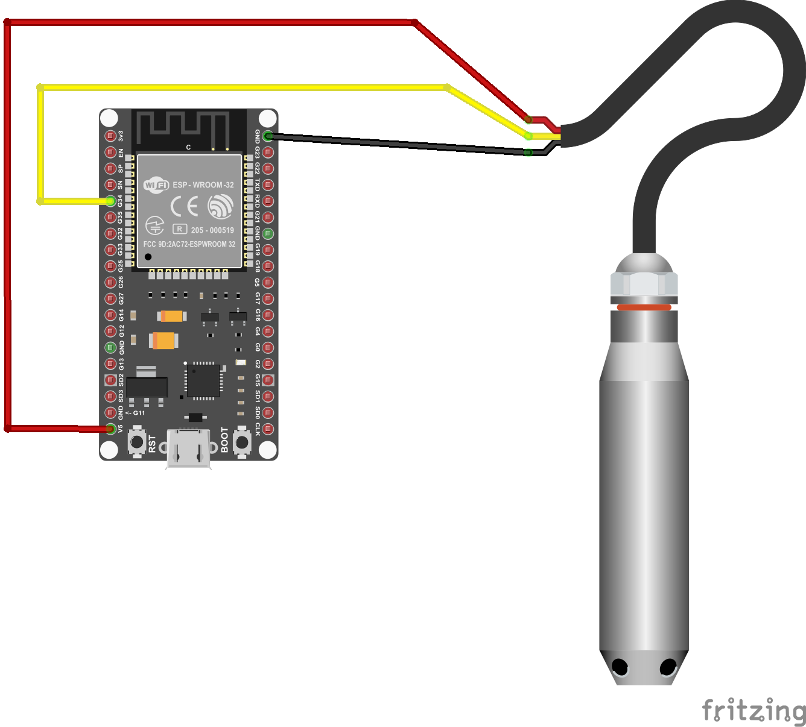
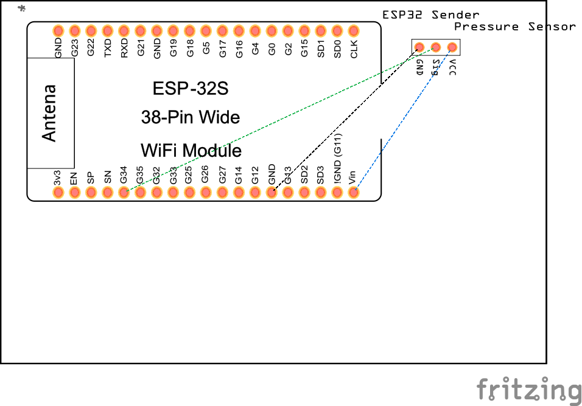
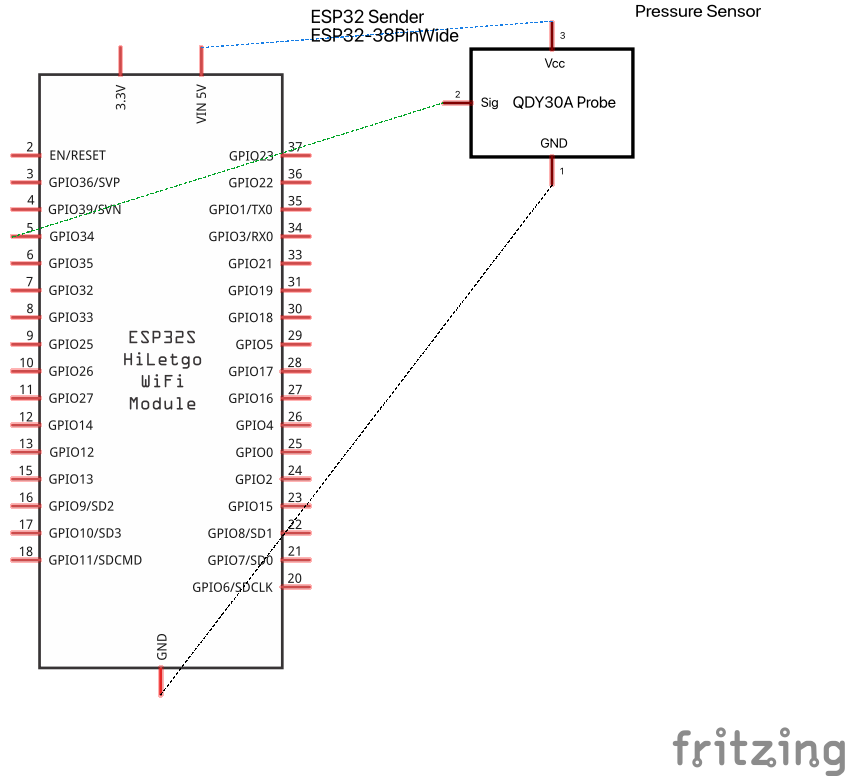

# Esp32-Tank-Monitor

## Description
This project is a low-power QDY30A hydrostatic liquid level sensor connected to an ESP32 sender node that runs 24/7 to take stable tank measurements. The data is transmitted via the ESP-NOW communication protocol to an ESP32 receiver node, which displays the tank level as a percentage, the remaining volume in liters, and the real time clock synced from an NTP server. All information is displayed on an OLED screen using the I2C communication protocol. Additionally, an active buzzer is activated when the water level drops below 50%, triggering an audible alarm to alert users of a low water state. In addition to the main nodes, the system includes a diagnostic tool built on a Heltec v3 to run a quick diagnostic report readings. This diagnostic interface supports two communications methods: ESP-NOW and UART. Lastly, an external Heltec v3 is used to calibrate the hydrostatic sensor. 

### Key Specs
- **Power**: 
    * **ESP32**: Both ESP32, sender and receiver are wall plugged with operating voltage 5V DC via USB-C wall adapters.
    * **QDY30A**: The hydrostatic sensor powered by the 5V output that the ESP32 provides.
- **Sensor Type**: QDY30A Hydrostatic pressure sensor(analog output, 0-3.3V 5V DC 2m range) that sits before the bottom of the tank.
- **Tank Height**: The calibrated full height of `1.02m` is according to the physical placement of the sensor before the bottom of the tank floor
- **Tank Capacity**:
    * **Total Capacity**: 1,000 liters
    * **Usable Capacity**: 688 liters
    * **Note**: The usable capacity is capped at 688 liters because the water pump's pipe is positioned 21 cm above the tank floor. Any water below this point is unreachable by the pump, leaving 688 liters of active, usable volume.
- **Connectivity**: 
    * **ESP-NOW**: Establishes a wireless communication between the ESP32 transmitter and the ESP32 receiver for a real-time data sharing, also connects the wireless diagnostic tool device. 
    * **Wi-Fi (NTP)**: The ESP32 sender node uses Wi-Fi to synchronize the local internal RTC with the NTP server and fetches the time.
    * **UART**: A hardwired interface connecting the ESP32 sender node to the Heltec diagnostic device to read the data and display it in the Heltec built-in oled screen. 

### Hardware
#### Core electronics
- **ESP32**:
    * **ESP32 WROOM 32U (Sender Node)**: ESP32 with 2.4GHZ external antenna to manage Wi-Fi connections to fetch NTP time, hydrostatic level sensor readings, and share data across ESP-NOW and UART, all protected by a IP67 enclosure in outdoors. 
    * **ESP32 WROOM 32D (Receiver Node)**: ESP32 located indoors with built-in antenna, receives the wireless ESP-NOW data packets.
- **Heltec V3 (Diagnostic and Calibration tool)**: A portable device used to connect either wireless (ESP-NOW) or physical serial (UART) to read diagnostic reports and calibration status.

#### Sensors
- **Pressure Sensor**:QDY30A Hydrostatic pressure sensor positioned at the bottom of the tank, the specs for this project are ( 0-3.3V 5V DC 2m range)

#### User interface & Alert Hardware
- **SSD1306 0.96-inch OLED Display**: Connected to the ESP32 receiver node via I2C(GPIO21/22) to output real-time metrics (Percentage, Liters, and NTP-synced time)
- **3V Active Buzzer**: Connected to GPIO18 on the receiver node to sound an audible warning if the usable water drops below 50%.

#### Infrastructure & Power
- **External Wi-Fi Antenna**: High-gain omnidirectional 2.4GHZ external antenna to improve the signal between both nodes.
- **IP67 5V Extension cord**: Ruggedized outdoor 5V Extension cord  IP67 rate that provides a steady voltage to the outdoors ESP32
- **5V DC Wall Power Adapter**: A Standard 5V wall power adapter USB-C that powers the ESP32 indoors
- **IP67 Enclosure**: Ip67 plastic enclosure.

## Why I Used A Pressure Sensor
- **Why I Chose The  QDY30A hydrostatic sensor**: My initial design considered the **JSN-SR04T waterproof ultrasonic sensor**, however, due the real -world conditions inside the water tank specifically condensation inside of the tank and the possible small insects that could live there the reading of the sensor were not reliable, afterwards I decided to move to the QDY30A hydrostatic liquid level sensor because it uses a precise pressure calculation that nothing can interfere with the sensor readings.

- **How The Sensor Works**: The QDY30A hydrostatic liquid level sensor is a industrial-grade, high-precision sensor, the sensor located at the bottom of the tank and calculates the water level of the tank by the physical weight of the water pushing down on it (pressure). As the tank fills up, and the water gets taller and heavier, this increase of physical weight creates higher water pressure. The technical parameters of the QDY30A hydrostatic liquid level sensor model selected for this project are: 2m range, 0V-3.3V, and 5V DC which means when the tank is empty or full the sensor sends an analog signal to the ESP32 where 0V = 0cm, and 3.3v = 2m(theoretical) limit but for my project the highest volume of water for my water tank is at 1.02m that gives us 1.49v, and lastly the 5V DC means the QDY30A hydrostatic needs to be powered by an input of 5V to work.

## How The System works
The operational logic of the project is:

### ESP32 Sender Node 
* **1.** The ESP32 Sender node connects to the Wi-Fi network and syncs the time with the NTP server.
* **2.** The ESP32 sender node powers(5V DC) the pressure sensor.
* **3.** The QDY30A hydrostatic sensor takes the readings, and sends back the data to the ESP32 sensor node.
* **4.** The ESP32 sender node converts the analog input that comes from the hydrostatic sensor to digital data and makes all calculations(percentage, liters, voltage).
* **5.** The ESP32 sender node sends the data through ESP-NOW communication protocol to the ESP32 receiver node which is waiting.

### ESP32 Receiver Node
* **6.** The ESP32 receiver node updates its I2C OLED dashboard to display the water volume in percentage, the remaining water volume in liters, and the current timestamp.
* **7.** The ESP32 receiver node checks if the water percentage drops below or equal to 50%, it triggers the active buzzer alarm.

## Hardware Connection & Wiring Guide

### Outdoor Transmitter Node (ESP32 WROOM-32U)

#### BreadBoard

#### PCB

#### Schema
